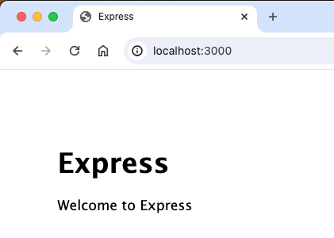

## 安装
### step-1 初始化项目
```shell
~/0gdh/gdv2web % mkdir studemo
~/0gdh/gdv2web % cd studemo
~/0gdh/gdv2web/studemo % npm init
```
此命令将要求你输入几个参数，例如此应用的名称和版本。 你可以直接按“回车”键接受大部分默认设置即可，下面这个除外：
```shell
entry point: (index.js)
```
键入 studemo.js 或者你所希望的名称，这是当前应用的入口文件。如果你希望采用默认的 index.js 文件名，只需按“回车”键即可。

在vscode中查看生成的package.json，或者输入如下cat命令查看
```shell
~/0gdh/gdv2web/studemo % cat package.json
```
以下是npm init 命令生成的package.json
```json
{
  "name": "studemo",
  "version": "1.0.0",
  "description": "demo of student management",
  "main": "studemo.js",
  "scripts": {
    "test": "echo \"Error: no test specified\" && exit 1"
  },
  "author": "George Donne",
  "license": "ISC"
}
```

### step-2 安装express
输入npm install express --save
```shell
~/0gdh/gdv2web/studemo % npm install express --save

added 64 packages, and audited 65 packages in 12s

12 packages are looking for funding
  run `npm fund` for details

found 0 vulnerabilities
```
安装express完成后，新增node_modules目录和package-lock.json文件。
```shell
~/0gdh/gdv2web/studemo % ls -l
total 72
drwxr-xr-x  67 george1442  staff   2144 May 10 09:22 node_modules
-rw-r--r--   1 george1442  staff  25436 May 10 09:22 package-lock.json
-rw-r--r--   1 george1442  staff    293 May 10 09:22 package.json
-rw-r--r--   1 george1442  staff    935 May 10 09:20 readme.md
```
### step-3 安装express-generator，并指定视图模版引擎为pug
输入命令npx express-generator --view=pug
```shell
~/0gdh/gdv2web/studemo % npx express-generator --view=pug
destination is not empty, continue? [y/N] y

   create : public/
   create : public/javascripts/
   create : public/images/
   create : public/stylesheets/
   create : public/stylesheets/style.css
   create : routes/
   create : routes/index.js
   create : routes/users.js
   create : views/
   create : views/error.pug
   create : views/index.pug
   create : views/layout.pug
   create : app.js
   create : package.json
   create : bin/
   create : bin/www

   install dependencies:
     $ npm install

   run the app:
     $ DEBUG=studemo:* npm start
```

### step-4 安装依赖
参考step-3给出的命令，输入npm install安装依赖。
```shell
~/0gdh/gdv2web/studemo % npm install
npm WARN deprecated core-js@2.6.12: core-js@<3.23.3 is no longer maintained and not recommended for usage due to the number of issues. Because of the V8 engine whims, feature detection in old core-js versions could cause a slowdown up to 100x even if nothing is polyfilled. Some versions have web compatibility issues. Please, upgrade your dependencies to the actual version of core-js.

added 71 packages, removed 4 packages, changed 20 packages, and audited 132 packages in 18s

13 packages are looking for funding
  run `npm fund` for details

7 vulnerabilities (2 low, 5 high)

To address issues that do not require attention, run:
  npm audit fix

To address all issues, run:
  npm audit fix --force

Run `npm audit` for details.
```
### step-5 启动web服务器

参考step-3输入命令DEBUG=studemo:* npm start 启动web服务器。
```shell
~/0gdh/gdv2web/studemo % DEBUG=studemo:* npm start

> studemo@0.0.0 start
> node ./bin/www

  studemo:server Listening on port 3000 +0ms
```
在浏览器输入 localhost:3000，并按回车

后台显示
```shell
GET / 200 484.788 ms - 170
GET /stylesheets/style.css 200 16.526 ms - 111
GET /favicon.ico 404 17.037 ms - 1202
```
浏览器显示



DONE!!!

### 安装 sequelize
参考github指南[[链接](https://github.com/demopark/sequelize-docs-Zh-CN/blob/master/core-concepts/getting-started.md)]，执行命令npm i sequelize。
```shell
~/0gdh/gdv2web/studemo % npm i sequelize

added 20 packages, and audited 152 packages in 7s

14 packages are looking for funding
  run `npm fund` for details

7 vulnerabilities (2 low, 5 high)

To address issues that do not require attention, run:
  npm audit fix

To address all issues, run:
  npm audit fix --force

Run `npm audit` for details.
```
### 安装MySQL驱动for sequelize

```shell
~/0gdh/gdv2web/studemo % npm i mysql2

added 11 packages, and audited 163 packages in 4s

14 packages are looking for funding
  run `npm fund` for details

7 vulnerabilities (2 low, 5 high)

To address issues that do not require attention, run:
  npm audit fix

To address all issues, run:
  npm audit fix --force

Run `npm audit` for details.
```

### 安装 prisma
```shell
~/0gdh/gdv2web/studemo % npx prisma
Need to install the following packages:
prisma@5.13.0
Ok to proceed? (y) y

    ◭  Prisma is a modern DB toolkit to query, migrate and model your database (https://prisma.io)
```
### prisma 初始化
```shell
~/0gdh/gdv2web/studemo % npx prisma init

✔ Your Prisma schema was created at prisma/schema.prisma
  You can now open it in your favorite editor.

Next steps:
1. Set the DATABASE_URL in the .env file to point to your existing database. If your database has no tables yet, read https://pris.ly/d/getting-started
2. Set the provider of the datasource block in schema.prisma to match your database: postgresql, mysql, sqlite, sqlserver, mongodb or cockroachdb.
3. Run npx prisma db pull to turn your database schema into a Prisma schema.
4. Run npx prisma generate to generate the Prisma Client. You can then start querying your database.

More information in our documentation:
https://pris.ly/d/getting-started

┌────────────────────────────────────────────────────────────────┐
│  Developing real-time features?                                │
│  Prisma Pulse lets you respond instantly to database changes.  │
│  https://pris.ly/cli/pulse                                     │
└────────────────────────────────────────────────────────────────┘
```

### 内省数据库
```shell
~/0gdh/gdv2web/studemo % npx prisma db pull
Prisma schema loaded from prisma/schema.prisma
Environment variables loaded from .env
Datasource "db": MySQL database "gdtest" at "localhost:3306"

✔ Introspected 1 model and wrote it into prisma/schema.prisma in 682ms
      
Run npx prisma generate to generate Prisma Client.
```

### 设定数据库基线
```shell
~/0gdh/gdv2web/studemo % mkdir -p prisma/migrations/0_init
~/0gdh/gdv2web/studemo % cd pri*
~/0gdh/gdv2web/studemo/prisma % ls -l
total 8
drwxr-xr-x  3 george1442  staff   96 May 10 16:28 migrations
-rw-r--r--  1 george1442  staff  369 May 10 16:23 schema.prisma
~/0gdh/gdv2web/studemo/prisma % cd mi*
~/0gdh/gdv2web/studemo/prisma/migrations % ls -l
total 0
drwxr-xr-x  2 george1442  staff  64 May 10 16:28 0_init
~/0gdh/gdv2web/studemo/prisma/migrations % cd ..
~/0gdh/gdv2web/studemo/prisma % cd ..
~/0gdh/gdv2web/studemo % npx prisma migrate diff --from-empty --to-schema-datamodel prisma/schema.prisma --script > prisma/migrations/0_init/migration.sql
~/0gdh/gdv2web/studemo % npx prisma migrate resolve --applied 0_init
Environment variables loaded from .env
Prisma schema loaded from prisma/schema.prisma
Datasource "db": MySQL database "gdtest" at "localhost:3306"

Migration 0_init marked as applied.
```

### 安装 prisma 客户端
```shell
~/0gdh/gdv2web/studemo % npm install @prisma/client

added 1 package, and audited 164 packages in 7s

14 packages are looking for funding
  run `npm fund` for details

7 vulnerabilities (2 low, 5 high)

To address issues that do not require attention, run:
  npm audit fix

To address all issues, run:
  npm audit fix --force

Run `npm audit` for details.
```
### 安装 nodemon
```shell
~/0gdh/gdv2web/studemo % npm install --save-dev nodemon

added 30 packages, and audited 194 packages in 19s

18 packages are looking for funding
  run `npm fund` for details

7 vulnerabilities (2 low, 5 high)

To address issues that do not require attention, run:
  npm audit fix

To address all issues, run:
  npm audit fix --force

Run `npm audit` for details.
```

### 安装chart.js
```shell
~/0gdh/gdv2web/studemo % npm install chart.js

added 3 packages, and audited 197 packages in 4s

18 packages are looking for funding
  run `npm fund` for details

7 vulnerabilities (2 low, 5 high)

To address issues that do not require attention, run:
  npm audit fix

To address all issues, run:
  npm audit fix --force

Run `npm audit` for details.
npm notice 
npm notice New minor version of npm available! 10.5.0 -> 10.8.0
npm notice Changelog: https://github.com/npm/cli/releases/tag/v10.8.0
npm notice Run npm install -g npm@10.8.0 to update!
npm notice 
```

### 增加score表格
240517
```shell
~/0gdh/gdv2web/studemo % npx prisma migrate dev --name score-model
Environment variables loaded from .env
Prisma schema loaded from prisma/schema.prisma
Datasource "db": MySQL database "gdtest" at "localhost:3306"

Applying migration `20240517084228_score_model`

The following migration(s) have been created and applied from new schema changes:

migrations/
  └─ 20240517084228_score_model/
    └─ migration.sql

Your database is now in sync with your schema.

✔ Generated Prisma Client (v5.13.0) to ./node_modules/@prisma/client in 126ms
```

<!--
240511：Nodejs 第四十章（prisma）;https://blog.csdn.net/qq1195566313/article/details/136272415
// DEBUG=studemo:* npm run devstart
// DEBUG=studemo:* npm start
240524: node.js小项目 -- 学生信息管理系统；https://www.cnblogs.com/yyrecord/p/13454927.html
-->